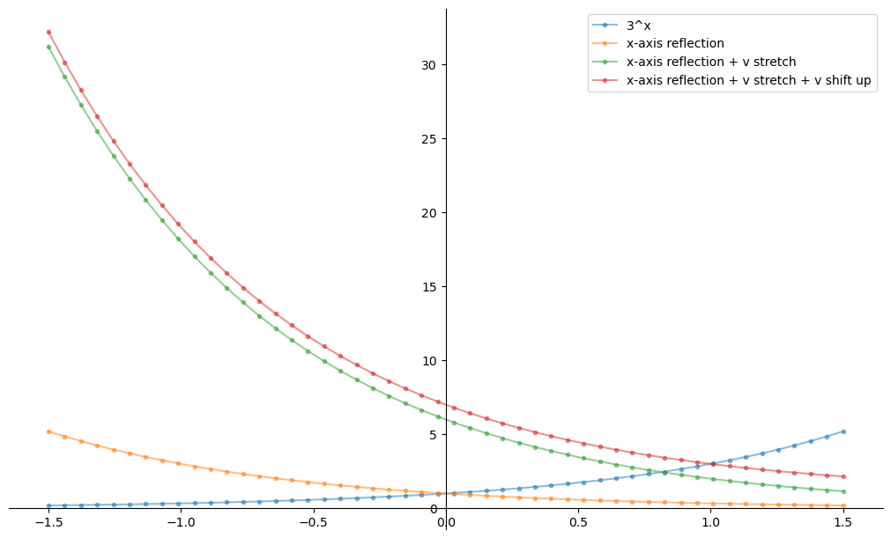

# Algebraic and graphical notebooks using Sympy, Numpy, Matplotlib etc.

## Sample from Exponential functions.

```python
import numpy as np
import matplotlib.pyplot as plt
import sympy as sym
from IPython.display import display,Math
```


```python
display(Math('\\text{Exponential function } f(x) = 3^x'))
display(Math('\\text{Exponential function } g(x) = 3^{-x} \\text{ is an x-axis reflection of } f(x)=3^x'))
display(Math('\\text{Exponential function } h(x) = 6 * 3^{-x} \\text{ is a vertical stretch of } g(x) = 3^{-x}'))
display(Math('\\text{Exponential function } k(x) = 6 * 3^{-x} + 1 \\text{ is a vertical shift up of } 6 * 3^{-x}'))
```


$\displaystyle \text{Exponential function } f(x) = 3^x$

$\displaystyle \text{Exponential function } g(x) = 3^{-x} \text{ is an x-axis reflection of } f(x)=3^x$

$\displaystyle \text{Exponential function } h(x) = 6 * 3^{-x} \text{ is a vertical stretch of } g(x) = 3^{-x}$

$\displaystyle \text{Exponential function } k(x) = 6 * 3^{-x} + 1 \text{ is a vertical shift up of } 6 * 3^{-x}$


```python
def get_coordinates(a_=1,b_=3,c_=1,d_=0):
    a,b,c,d,x = sym.symbols('a,b,c,d,x')
    expr = (a * ( b**(c*x) )) + d
    
    a = a_
    b = b_
    c = c_
    d = d_
    
    x_points = np.linspace(-1.5, 1.5)
    y_points = []
    
    for x_ in x_points:
        y_ = sym.Float(
            expr.subs({ 'x': x_, 'a': a_, 'b': b_, 'c': c_, 'd': d_ })
        )
        y_points.append(y_)
    
    return [x_points, y_points]
```


```python
fig, (ax0) = plt.subplots(nrows=1, layout='constrained', figsize=(10,6))

[x0_points, y0_points] = get_coordinates()
ax0.plot(x0_points, y0_points, alpha=0.5, marker='.', label="3^x")

[x1_points, y1_points] = get_coordinates(c_=-1)
ax0.plot(x1_points, y1_points, alpha=0.5, marker='.', label="x-axis reflection")

[x2_points, y2_points] = get_coordinates(a_=6, c_=-1)
ax0.plot(x2_points, y2_points, alpha=0.5, marker='.', label="x-axis reflection + v stretch")

[x2_points, y2_points] = get_coordinates(a_=6, c_=-1, d_=1)
ax0.plot(x2_points, y2_points, alpha=0.5, marker='.', label="x-axis reflection + v stretch + v shift up")

ax0.spines[["left", "bottom"]].set_position(("data", 0))
ax0.spines[["top", "right"]].set_visible(False)

ax0.legend()
plt.show()
```

    

